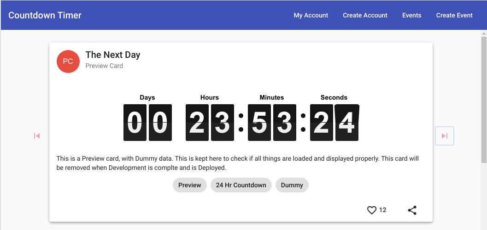

# Countdown Timer
This project was generated with [Angular CLI](https://github.com/angular/angular-cli) version 9.1.1.

This project was made for submission to the CWF-Spring 2020.
Check out CWF's [github page](https://scottkwang.github.io/CodeWithFriends-Spring2020/) to learn more!

This project is a simple Angular implementation of a Catalogue of Countdowns, to anything. It allows you to create and track countdown to any Event or Activity and then view the countdown to the event in real-time.

## Deployment and Code Quality

 

This project is deployed on Firebase and is hosted at https://countdowntimer-angular.web.app/. The source for the hosted application will be the master branch of this repository,

## Features

Some of the feature of this applications include

1. Material Style Cards to view countdowns.
2. Sharable links to countdowns, to facilitate better sharing of countdowns.
3. A like / favourite system to rank countdowns and display them in order of popularity.

## Development server

Run `ng serve` for a dev server. Navigate to `http://localhost:4200/`. The app will automatically reload if you change any of the source files.
